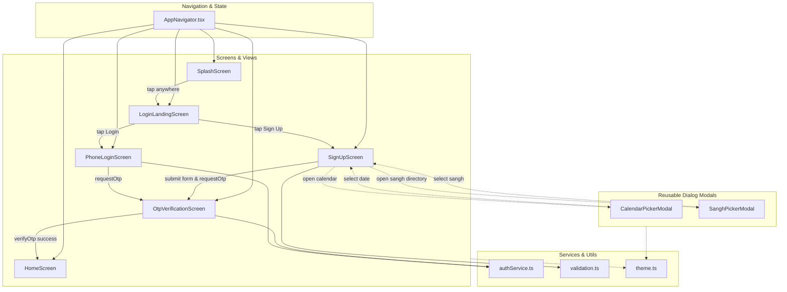

# JainSarthi — Project Structure & File Guide

> **Document Purpose:** Complete architectural guide explaining the full project directory hierarchy, the purpose of every folder type, and the exact role and function of every individual file in the repository.

---

## 1. High-Level Architecture Overview

The repository is organized into a **two-layer ecosystem**:

```
stitch_jainsarthi_community_app/
├── [Layer 1] Design System Prototypes (13 Stitch feature folders with code.html & screen.png)
└── [Layer 2] jainsarthi-expo/ (Production React Native Expo Mobile & Web App)
```

1. **Design System & Prototype Layer (Root Folders)**:
   - 13 folders created with Google Stitch containing single-file Tailwind CSS HTML previews (`code.html`) and visual screenshot benchmarks (`screen.png`).
   - Serves as the high-fidelity UI/UX design specification and visual reference for the mobile app.

2. **Mobile Application Layer (`jainsarthi-expo/`)**:
   - The production-grade cross-platform React Native app powered by Expo SDK 57.
   - Houses the TypeScript source code, theme system, reusable components, feature screens, and services.

---

## 2. Complete Project Directory Tree

```
stitch_jainsarthi_community_app/
├── 24_tirthankara_bhagwan_directory/     # Prototype: 24 Tirthankara Bhagwan directory
│   ├── code.html                         # Standalone HTML/Tailwind mockup
│   └── screen.png                        # Rendered visual mockup
├── community_news_samachar/              # Prototype: Sangh community news feed
│   ├── code.html
│   └── screen.png
├── create_account_sign_up/               # Prototype: Account registration screen
│   ├── code.html
│   └── screen.png
├── granth_aradhana_hub/                  # Prototype: Jain scripture / Granth hub
│   ├── code.html
│   └── screen.png
├── jainsarthi_home/                      # Prototype: Community Home dashboard
│   ├── code.html
│   └── screen.png
├── jainsarthi_manuscript_classic/        # Prototype: Traditional manuscript theme
│   ├── code.html
│   └── screen.png
├── login_landing/                        # Prototype: Main landing & welcome screen
│   ├── code.html
│   └── screen.png
├── login_mobile_number/                  # Prototype: Phone login input screen
│   ├── code.html
│   └── screen.png
├── nearby_vihar_sangh_map/               # Prototype: Sadhu/Sadhvi Vihar tracking map
│   ├── code.html
│   └── screen.png
├── otp_verification/                     # Prototype: OTP verification screen
│   ├── code.html
│   └── screen.png
├── panchang_calendar_tapasya_tracker/    # Prototype: Jain Panchang & fast tracker
│   ├── code.html
│   └── screen.png
├── shravak_profile_settings/             # Prototype: User / Shravak profile settings
│   ├── code.html
│   └── screen.png
├── splash_opening_animation/             # Prototype: Temple splash screen
│   ├── code.html
│   └── screen.png
│
├── CODE_READABILITY_REVIEW.md            # Code quality and readability analysis
├── PROJECT_STRUCTURE.md                  # This file: Directory & file reference
│
└── jainsarthi-expo/                      # Production React Native Application
    ├── App.tsx                           # Application root component
    ├── index.ts                          # Expo app registry entrypoint
    ├── app.json                          # Expo configuration & app metadata
    ├── package.json                      # Dependencies, scripts, and package manifests
    ├── tsconfig.json                     # TypeScript compiler configuration
    ├── README.md                         # Quick-start instructions
    ├── CLAUDE.md                         # Agent instructions pointer
    ├── AGENTS.md                         # Expo version constraints & guidelines
    │
    ├── assets/                           # App icons, splash screens, and artwork
    │   ├── icon.png                      # App launcher icon (1024x1024)
    │   ├── splash-icon.png               # Centered splash screen graphic
    │   ├── favicon.png                   # Web browser tab icon
    │   ├── android-icon-background.png   # Android adaptive icon background
    │   ├── android-icon-foreground.png   # Android adaptive icon foreground
    │   ├── android-icon-monochrome.png   # Android monochrome themed icon
    │   └── images/
    │       └── splash-temple.png         # High-res golden temple artwork
    │
    └── src/                              # Application TypeScript source code
        ├── components/                   # Reusable UI widgets & modal dialogs
        │   ├── ui.tsx                    # Shared UI primitives (Buttons, Field, Screen)
        │   ├── CalendarPickerModal.tsx   # Custom in-app Jain calendar date picker
        │   └── SanghPickerModal.tsx      # Searchable Jain Sangh directory picker
        │
        ├── navigation/                   # Routing & screen transitions
        │   └── AppNavigator.tsx          # Central route coordinator & state machine
        │
        ├── screens/                      # Screen views / container components
        │   ├── SplashScreen.tsx          # Initial spiritual welcome & fade animation
        │   ├── LoginLandingScreen.tsx    # Welcome screen with Login / Sign Up options
        │   ├── PhoneLoginScreen.tsx      # Phone input form with validation & masking
        │   ├── OtpVerificationScreen.tsx # 4-digit OTP input with countdown timer
        │   ├── SignUpScreen.tsx          # Comprehensive member registration form
        │   └── HomeScreen.tsx            # Main authenticated home dashboard
        │
        ├── services/                     # External services & backend API boundaries
        │   └── authService.ts            # Mock authentication & OTP service
        │
        ├── theme/                        # Visual styling & design tokens
        │   └── theme.ts                  # JainSarthi color palette & constants
        │
        ├── types/                        # TypeScript type definitions
        │   └── navigation.ts             # Route names, user models & form drafts
        │
        └── utils/                        # Pure utility functions & validation
            └── validation.ts             # Name, phone, and DOB validation engines
```

---

## 3. Explanation of Every Folder Type

| Folder Type | Typical Location | Purpose & Responsibility |
| :--- | :--- | :--- |
| **Design Prototype Folders** | Root (`/<screen_name>/`) | Self-contained visual design specs. Each contains a browser-viewable Tailwind CSS HTML file (`code.html`) and an exported visual mockup (`screen.png`). They serve as the design target when building React Native screens. |
| **App Root** | `jainsarthi-expo/` | Contains configuration files, build settings (`app.json`, `package.json`), entry point (`index.ts`), and root view (`App.tsx`). |
| **`assets/`** | `jainsarthi-expo/assets/` | Static media assets including launcher icons, splash illustrations, and vector artwork required by iOS, Android, and Web platforms. |
| **`src/components/`** | `jainsarthi-expo/src/components/` | Reusable presentation components and custom modals. These do not own business routes; they accept props and notify parents via callbacks. |
| **`src/screens/`** | `jainsarthi-expo/src/screens/` | Full-page views representing individual screens in the user flow. Screens compose components, handle form state, and interact with the navigator. |
| **`src/navigation/`** | `jainsarthi-expo/src/navigation/` | Routing logic, view switching, and navigation state. Coordinates the flow from Splash → Login → OTP → Home. |
| **`src/services/`** | `jainsarthi-expo/src/services/` | Boundary between the UI and external systems (REST APIs, Supabase, Firebase, SMS gateways). Abstracting here allows switching from mock data to real backend seamlessly. |
| **`src/theme/`** | `jainsarthi-expo/src/theme/` | Design system variables: brand colors (maroon, gold, cream), typography, and spacing tokens used consistently across all screens. |
| **`src/types/`** | `jainsarthi-expo/src/types/` | TypeScript interfaces, type aliases, and discriminated unions used across multiple screens and services. |
| **`src/utils/`** | `jainsarthi-expo/src/utils/` | Pure, testable helper functions without UI or state side-effects (date math, string parsing, regular expression validation). |

---

## 4. Deep-Dive: Use & Responsibility of Every File

### 4.1 Root Stitch Design Prototype Folders

Each of the 13 folders represents a core feature of the JainSarthi vision. Every folder has:
- `code.html`: A standalone web implementation using Tailwind CSS that can be opened in any web browser to preview layout, typography, and color harmony.
- `screen.png`: A high-resolution rendered screenshot of the mobile screen.

1. **`24_tirthankara_bhagwan_directory/`**:
   - Complete directory of the 24 Jain Tirthankaras (Bhagwan Rishabhdev to Bhagwan Mahavira), including Lanchhan (symbols), life events (Kalyanak), and iconography.
2. **`community_news_samachar/`**:
   - Community newsfeed showing announcements, Diksha events, Sangh Pratishtha Mahotsav, and local sangh circulars.
3. **`create_account_sign_up/`**:
   - The user onboarding and membership registration form featuring photo upload, name, DOB, Sangh selection, and language preference.
4. **`granth_aradhana_hub/`**:
   - Sacred library providing access to Jain stotras, Agamas, Pratikraman sutras, and Stavans.
5. **`jainsarthi_home/`**:
   - The primary authenticated user dashboard featuring daily Panchang, Tithi, Navkarshi times, quick prayer shortcuts, and Sangh updates.
6. **`jainsarthi_manuscript_classic/`**:
   - Design system foundation exploring traditional Indian manuscript art style, parchment textures, and ornate gold accents.
7. **`login_landing/`**:
   - The primary landing screen greeting users with "Jai Jinendra", today's tithi badge, and Login / Sign Up actions.
8. **`login_mobile_number/`**:
   - Mobile number entry screen with +91 Indian dialing prefix and privacy assurance badges.
9. **`nearby_vihar_sangh_map/`**:
   - Interactive map interface tracking Sadhu and Sadhvi Bhagwant Vihar (journeys) and locating nearby Jain Derasars/Dharamshalas.
10. **`otp_verification/`**:
    - 4-digit OTP entry screen with automated digit boxes, timer countdown, and resend action.
11. **`panchang_calendar_tapasya_tracker/`**:
    - Traditional Jain lunar calendar (Tithi, Sud/Vad, Pachkhan timings, Kalyanaks) and ascetic fasting tracker (Ayambil, Upvas, Ekasana).
12. **`shravak_profile_settings/`**:
    - Shravak/Shravika member profile with Sangh affiliation, sadhana preferences, language settings, and notifications.
13. **`splash_opening_animation/`**:
    - Animated startup screen featuring the sacred Shikharji temple graphic and the revered Jain motto: *"Parasparopagraho Jīvānām"*.

---

### 4.2 Application Root Files (`jainsarthi-expo/`)

- **`App.tsx`**:
  - The root React component rendered by Expo.
  - Wraps the entire application in a `SafeAreaView` and mounts the dark-style `StatusBar` and `AppNavigator`.
- **`index.ts`**:
  - The JavaScript entry point registered with Expo's runtime (`registerRootComponent(App)`).
- **`app.json`**:
  - Expo application manifest. Configures the app name (`JainSarthi`), slug, orientation (`portrait`), icons, splash background (`#FFF8F5`), and device permissions (e.g. `expo-image-picker` photo library permissions).
- **`package.json`**:
  - Declares all dependencies (`expo`, `react`, `react-native`, `expo-image-picker`, `expo-status-bar`) and npm run scripts (`npm start`, `npm run android`, `npm run ios`, `npm run web`).
- **`tsconfig.json`**:
  - Configures the TypeScript compiler with strict type-checking and Expo's base tsconfig preset.
- **`README.md`**, **`CLAUDE.md`**, **`AGENTS.md`**:
  - Project documentation, quick-start commands, and runtime constraints (such as Expo SDK 57 guidelines).

---

### 4.3 Assets (`jainsarthi-expo/assets/`)

- **`icon.png`**: Square 1024x1024 PNG used as the primary mobile app icon.
- **`splash-icon.png`**: The centered graphic displayed on native iOS and Android launch screens while the JavaScript bundle loads.
- **`favicon.png`**: 32x32 icon displayed in web browser tabs when running Expo Web.
- **`android-icon-foreground.png`**, **`android-icon-background.png`**, **`android-icon-monochrome.png`**:
  - Android adaptive icon layers that adapt to round, squircle, and dynamic material theme shapes on modern Android devices.
- **`images/splash-temple.png`**:
  - High-resolution spiritual illustration of a Jain temple spire (Shikhar) used in the splash screen animation.

---

### 4.4 Presentation Components (`jainsarthi-expo/src/components/`)

- **`ui.tsx`**:
  - Core UI component library. Exports reusable building blocks:
    - `<Screen>`: Safe layout container supporting optional vertical scrolling.
    - `<BackButton>`: Consistent circular back navigation arrow.
    - `<PrimaryButton>`: High-emphasis maroon CTA button with forward arrow (`→`).
    - `<SecondaryButton>`: Subtle outlined button for secondary actions.
    - `<Field>`: Labelled text input styled with parchment theme borders.
    - `<RadioOption>`: Accessible custom radio card with inner selection dot.
    - `<TempleMark>`: Scalable vector icon rendering a sacred temple silhouette.
    - `<CameraIcon>`: Vector camera glyph used for photo upload prompts.
- **`CalendarPickerModal.tsx`**:
  - Custom in-app calendar dialog that replaces native browser/mobile pickers.
  - Features:
    - Centered modal dialog consistent on both Mobile Expo Go and Desktop Web.
    - Month navigation (`‹` and `›`).
    - Quick Year Selector Grid (scrollable from 1930 to 2026).
    - Formats output as `DD / MM / YYYY`.
    - Automatically syncs date state on open via `useEffect`.
- **`SanghPickerModal.tsx`**:
  - Full-screen/centered directory modal for choosing a Jain Sangh.
  - Features:
    - Live text search filter by Sangh name, city, or state.
    - Pre-loaded with 10 prominent Sanghs (Ahmedabad, Palitana, Mumbai, Surat, Jaipur, Pune, Bengaluru, Kolkata, etc.).
    - Active selection checkmark indicator.

---

### 4.5 Feature Screens (`jainsarthi-expo/src/screens/`)

- **`SplashScreen.tsx`**:
  - Displays the temple artwork, the sacred sutra *"Parasparopagraho Jīvānām"*, and fades in smoothly using React Native `Animated.timing`. Tapping anywhere transitions to the landing screen.
- **`LoginLandingScreen.tsx`**:
  - Welcome portal showcasing today's Tithi (*Sud Ekam • Navkarshi 07:18 AM*), brand mark, and routes to "Login" or "Sign Up".
- **`PhoneLoginScreen.tsx`**:
  - Dedicated mobile login screen. Formats Indian 10-digit mobile numbers with space masking (`98765 43210`) and triggers the OTP verification flow.
- **`OtpVerificationScreen.tsx`**:
  - 4-digit OTP entry screen with separate digit display boxes, a 42-second countdown timer, an OTP resend action, and mock verification.
- **`SignUpScreen.tsx`**:
  - Complete Shravak member registration form:
    1. **Profile Photo**: Pick image from photo gallery with `expo-image-picker` and remove option.
    2. **Full Name**: Text input with proper capitalization.
    3. **Date of Birth**: Tappable input triggering `CalendarPickerModal`.
    4. **Select Sangh**: Tappable card triggering `SanghPickerModal`.
    5. **Mobile Number**: Formatted 10-digit Indian phone field.
    6. **Language Preference**: Radio buttons for Hindi (`हिंदी`) and English.
    7. **Terms & Conditions**: Toggle checkbox agreeing to the Sangh Charter.
- **`HomeScreen.tsx`**:
  - The authenticated landing dashboard with top bar navigation, "Jai Jinendra" greeting, and hamburger menu.

---

### 4.6 Navigation (`jainsarthi-expo/src/navigation/`)

- **`AppNavigator.tsx`**:
  - Central routing hub for the application.
  - Maintains `route` state (`splash` | `landing` | `phoneLogin` | `signUp` | `otp` | `home`).
  - Passes transition callbacks (`onLogin`, `onSignUp`, `onBack`, `startOtp`, `verify`) to screens.

---

### 4.7 Services & Backend Boundaries (`jainsarthi-expo/src/services/`)

- **`authService.ts`**:
  - Encapsulates authentication calls.
  - Provides `requestOtp(phone)` and `verifyOtp(code)` with simulated network delays.
  - Acts as a clean boundary: when connecting Supabase, Firebase, or a custom REST backend, only this file needs to be modified without changing screen code.

---

### 4.8 Theme & Design Tokens (`jainsarthi-expo/src/theme/`)

- **`theme.ts`**:
  - Declares the color palette:
    - `surface`: `#FFF8F5` (Warm parchment cream)
    - `surfaceLow`: `#FFF1E9` (Subtle sand background)
    - `surfaceHigh`: `#F9E4D8` (Warm beige card highlight)
    - `maroon`: `#8B2635` (Sacred temple manuscript crimson)
    - `gold`: `#B8860B` (Aura / sanctum gold)
    - `goldLight`: `#FFDEA6` (Soft halo glow)
    - `ink`: `#241912` (Primary readable text)
    - `muted`: `#564242` (Secondary descriptive text)
    - `outline`: `#897172` (Borders and divider lines)

---

### 4.9 Types (`jainsarthi-expo/src/types/`)

- **`navigation.ts`**:
  - TypeScript definitions for:
    - `RouteName`: Union of all valid route keys.
    - `LanguagePreference`: `'hindi' | 'english'`.
    - `SignUpDraft`: Form state object carrying registration details across steps.

---

### 4.10 Utilities (`jainsarthi-expo/src/utils/`)

- **`validation.ts`**:
  - Pure validation routines:
    - `validateFullName(name)`: Verifies length and ensures characters match English, Devanagari (Hindi), or Gujarati alphabets.
    - `validateDOB(dob)`: Verifies format, days-in-month (including February leap years), and ensures age is between 5 and 120 years.
    - `validatePhone(phone)`: Verifies valid 10-digit Indian mobile number format.

---

## 5. Architectural Data & Navigation Flow



---

## 6. File Extension & Format Reference

| Extension | Meaning | Role in JainSarthi |
| :--- | :--- | :--- |
| **`.tsx`** | TypeScript JSX | React components containing both logic and UI element markup (e.g. `SignUpScreen.tsx`, `CalendarPickerModal.tsx`). |
| **`.ts`** | Pure TypeScript | Non-UI code such as types, helper functions, validation routines, and services (e.g. `theme.ts`, `validation.ts`, `authService.ts`). |
| **`.json`** | JSON Data | Configuration manifests (`package.json`, `app.json`, `tsconfig.json`). |
| **`.html`** | HTML Document | Browser-viewable prototypes built with Tailwind CSS in the Stitch design folders. |
| **`.png`** | Image Asset | Visual mockups (`screen.png`) and application icons/graphics (`splash-temple.png`). |
| **`.md`** | Markdown Document | Technical documentation, architecture guides, and coding reviews. |
